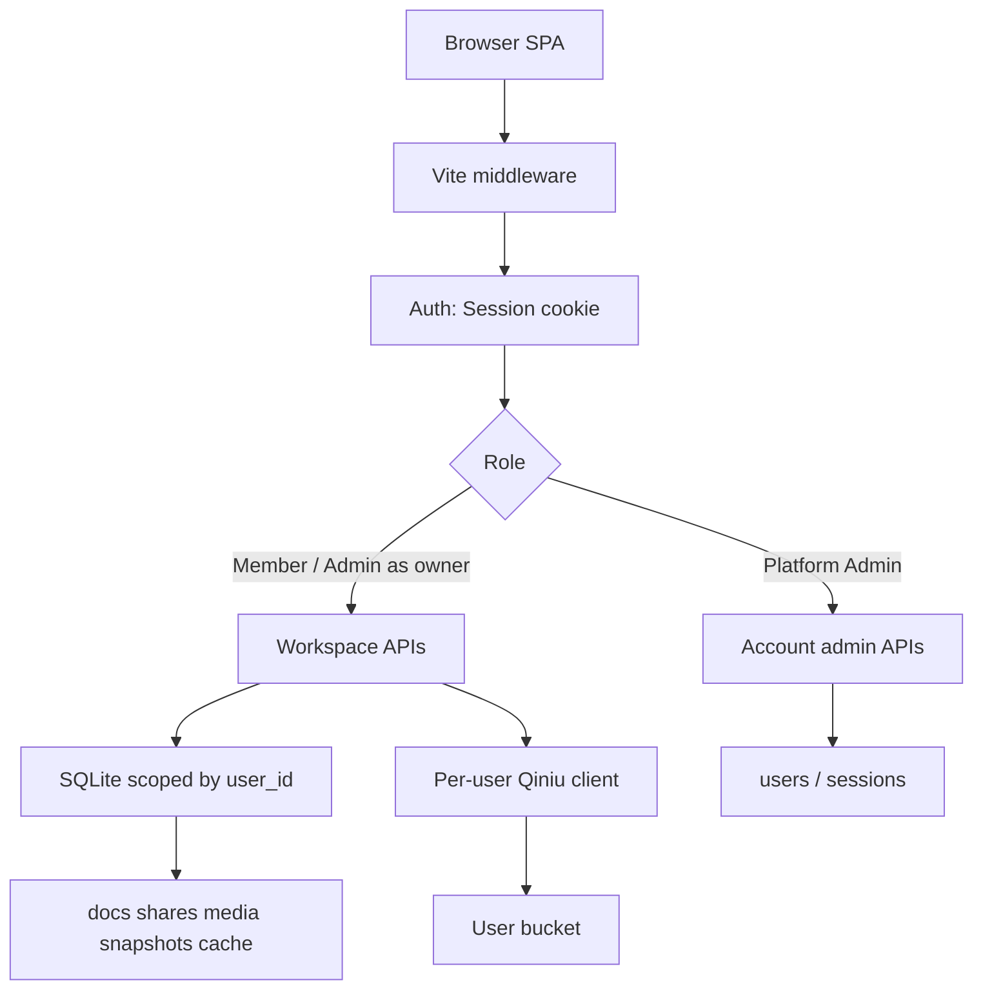
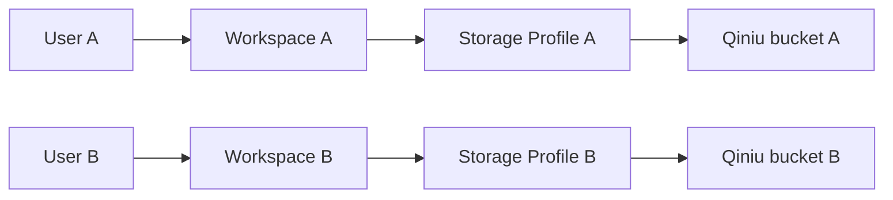

# 多用户分角色平台

Feature Name: multi-user-rbac
Updated: 2026-09-03

## Description

把 PTDoc 从「单进程、全局七牛、无鉴权」升级为「账号 + 角色 + 每用户独立工作区 + 每用户七牛配置」。现有 Vite 中间件、SQLite、文档/分享/媒体/快照能力保留；所有读写在 Current User 范围内执行。Platform Admin 只管理账号，不读取他人 Workspace。

## Architecture

请求进入 Vite 中间件后先鉴权，再按 Role 分流到账号管理或用户工作区。对象存储客户端按请求从该用户 Storage Profile 即时构造，替代进程级全局七牛单例。



登录后的数据边界：



引导与迁移：进程启动时校验 `PTDOC_DATA_KEY`，缺失则直接报错退出。`initDB()` 建新表、给旧表补 `user_id`。`users` 为空时进入 Setup Page，由部署者创建首位 Platform Admin；创建成功后把无主记录归属到该账号。运行期七牛配置只来自 Settings Page 中的 Storage Profile，不再读取进程级 `QINIU_*`。

## Components and Interfaces

### 1. 鉴权层 `src/server/auth.ts`

新增模块，不引入第三方会话库。

- 密码：`node:crypto.scrypt`，盐 16 字节，哈希以 `scrypt$N$r$p$salt$hash` 形式落库。
- Session：随机 32 字节 token，`SHA-256` 后存 `sessions` 表；浏览器持有 httpOnly、SameSite=Lax、Path=/ 的 Cookie `ptdoc_session`。
- 有效期：滑动 7 天；每次鉴权成功刷新 `expires_at`。
- `requireUser(req)`：解析 Cookie → 查有效 Session → 返回 `{ id, username, role, status }`；停用或过期则 401。
- `requireAdmin(user)`：`role !== 'admin'` 则 403。
- 登录失败计数：内存 Map，键为用户名小写，5 次失败锁定 15 分钟。

公开路径（无需 Session）：

- `GET /api/setup/status`（是否已初始化）
- `POST /api/setup`（仅当 `users` 为空时创建首位 Platform Admin）
- `POST /api/auth/register`（仅当已完成初始化）
- `POST /api/auth/login`
- 静态前端资源

`GET /s/:id` 需要有效 Session，且分享记录的 `user_id` 必须等于 Current User。其余 `/api/*` 必须带有效 Session。

### 2. 账号 API（并入 `src/server/api.ts` 或拆 `src/server/auth-api.ts`）

```
GET    /api/setup/status           { initialized: boolean }
POST   /api/setup                  { username, password } 仅 users 为空时可用，创建 admin 并迁移无主数据
POST   /api/auth/register          { username, password } -> { id, username, role }
POST   /api/auth/login             { username, password } -> Set-Cookie + { id, username, role }
POST   /api/auth/logout            清除 Cookie + 删 Session
GET    /api/auth/me                当前用户资料（无密钥）
POST   /api/auth/password          { old_password, new_password } 改密并轮换 Session
GET    /api/admin/users            仅 admin：账号列表
POST   /api/admin/users/:id/role   { role: "admin"|"member" }
POST   /api/admin/users/:id/status { status: "active"|"disabled" }
POST   /api/admin/users/:id/reset-password { password }
```

用户名规则：3–32 字符，`[a-zA-Z0-9._-]`，大小写不敏感唯一。密码：8–72 字符。

### 3. Storage Profile `src/server/storage.ts`

替代 `qiniu-uploader.ts` 中的进程级 `config` 单例。保留 `uploadToQiniu` / `deleteFromQiniu` 签名，增加必填参数 `profile: QiniuConfig`。

```
GET    /api/storage                当前用户配置（secret_key 以 configured: boolean 代替明文）
PUT    /api/storage                保存配置；先校验再落库
POST   /api/storage/test           用请求体配置做连通性校验，不落库
```

连通性校验：用提交的 AK/SK 调七牛 `BucketManager.buckets()` 或对目标 bucket 做 `stat` 一个不存在 key，根据错误码判断凭证与桶是否可达。校验通过才允许 `PUT /api/storage` 将 `verified_at` 置为当前时间。

密钥落库：`secret_key_enc` 使用 `AES-256-GCM`，主密钥来自环境变量 `PTDOC_DATA_KEY`（32 字节 hex）。缺省时启动拒绝写入 Storage Profile，登录与文档读写仍可用。

`upload-api.ts` 与媒体删除路径：从 Session 取 `user_id` → 读已校验 Storage Profile → 解密 SK → 构造一次性 qiniu Mac。环境变量 `QINIU_*` 仅用于首次迁移写入初始 Admin 的 Profile，运行期上传不再读全局配置。

### 4. 工作区范围改造（`db.ts` + `api.ts`）

所有现有文档/分享/媒体/快照/缓存查询增加 `user_id` 谓词。API 层从 Session 注入 `user_id`，禁止客户端传入。

现有接口保持路径不变，语义改为「当前用户 Workspace」：

```
GET/POST/DELETE /api/docs...
GET/POST/DELETE /api/share...
GET/DELETE      /api/media...
GET/POST        /api/mermaid-cache
GET             /s/:id
```

`doc_key` 唯一约束改为 `(user_id, doc_key)`。`mermaid_cache` 主键改为 `(user_id, mermaid_hash)`，避免用户 A 的图 URL 被用户 B 复用。

`GET /s/:id` 需登录且仅所属 User 可打开。七牛桶上的永久 HTML 是否可被匿名访问取决于该 User 自己的桶公开策略，系统托管页不提供匿名入口。

`scripts/build-site.ts`：增加 `--user <id|username>`；无参数时仅允许在单用户库上运行（迁移后即报错并提示指定用户），避免把全库文档打进同一个静态站。

### 5. 前端

- 未初始化：全屏 Setup Page（`src/ui/setup.ts`），创建首位 Platform Admin。
- 未登录：全屏登录/注册页（`src/ui/auth.ts`），挡住编辑器。
- 已登录：顶栏显示用户名、角色、「设置」「退出」；Admin 额外显示「账号管理」。
- Settings Page / 抽屉：保存 Storage Profile（字段对齐原 `QINIU_*`）与修改本人密码。
- 账号管理抽屉：列表 + 停用/启用 + 改角色 + 重置密码。
- 切换账号：logout 后清 `currentDocKey` / MiniSearch 索引 / 媒体与分享内存缓存，避免串数据。
- IndexedDB 文件句柄键从 `doc_key` 改为 `${userId}:${doc_key}`。

`vite.config.ts`：去掉启动时 `initQiniu(env)` 作为运行期依赖；保留 `initDB()`。`server.allowedHosts` 含 `.monkeycode-ai.online`。

### 6. 启动校验与引导

环境变量（写入 `.env.example`，不进前端）：

| 变量 | 作用 |
| --- | --- |
| `PTDOC_DATA_KEY` | 必需。32 字节 hex，用于加密用户七牛 SK。缺失则启动失败并报错 |
| `PTDOC_SESSION_TTL_DAYS` | 可选。Session 天数，默认 7 |

启动路径：`vite.config.ts` 在 `initDB()` 前检查 `PTDOC_DATA_KEY`；格式非法或缺失则抛错，开发服务器不进入可用状态。

`users` 为空时前端根据 `GET /api/setup/status` 进入 Setup Page。`POST /api/setup` 校验用户名密码规则后插入 Role=`admin` 的 User，执行无主数据迁移，签发 Session。已存在 User 时该接口返回 409。

`QINIU_*` 不再作为运行期配置来源。用户在 Settings Page 填写并保存 Storage Profile。旧 `.env` 中的 `QINIU_*` 可保留作手工参考，系统不自动导入。

## Data Models

SQLite 仍为 `data/ptdoc.db`。`initDB()` 内 `CREATE TABLE IF NOT EXISTS` + `ALTER TABLE` 兼容旧库。

```
users (
  id            INTEGER PRIMARY KEY AUTOINCREMENT,
  username      TEXT NOT NULL COLLATE NOCASE UNIQUE,
  password_hash TEXT NOT NULL,
  role          TEXT NOT NULL CHECK(role IN ('admin','member')),
  status        TEXT NOT NULL DEFAULT 'active' CHECK(status IN ('active','disabled')),
  created_at    INTEGER NOT NULL,
  updated_at    INTEGER NOT NULL
)

sessions (
  token_hash    TEXT PRIMARY KEY,
  user_id       INTEGER NOT NULL REFERENCES users(id),
  expires_at    INTEGER NOT NULL,
  created_at    INTEGER NOT NULL
)
CREATE INDEX idx_sessions_user ON sessions(user_id);
CREATE INDEX idx_sessions_exp  ON sessions(expires_at);

storage_profiles (
  user_id         INTEGER PRIMARY KEY REFERENCES users(id),
  access_key      TEXT NOT NULL,
  secret_key_enc  TEXT NOT NULL,
  bucket          TEXT NOT NULL,
  domain          TEXT NOT NULL,
  zone            TEXT NOT NULL DEFAULT 'Zone_z0',
  private_bucket  INTEGER NOT NULL DEFAULT 0,
  url_ttl         INTEGER NOT NULL DEFAULT 3600,
  verified_at     INTEGER,
  updated_at      INTEGER NOT NULL
)
```

既有表增量：

```
docs            + user_id INTEGER NOT NULL DEFAULT 0
shares          + user_id INTEGER NOT NULL DEFAULT 0
media           + user_id INTEGER NOT NULL DEFAULT 0
mermaid_cache   + user_id INTEGER NOT NULL DEFAULT 0
                主键改为 (user_id, mermaid_hash)
```

`doc_versions` / `images` 通过 `doc_id` / `share_id` 间接归属，不冗余 `user_id`。

`docs` 唯一索引：删除旧 `doc_key UNIQUE`，新建 `UNIQUE(user_id, doc_key)`。SQLite 对已有 UNIQUE 的迁移步骤：建新表 → 拷贝 → 更名，封装在 `migrateToMultiUser()`，仅当 `users` 为空时执行一次，并用 `schema_meta(key,value)` 记录 `multi_user=1`。

迁移伪流程：

1. 创建 `users/sessions/storage_profiles/schema_meta`。
2. `ALTER` 各业务表加 `user_id`（默认 0 表示无主），重建 `docs` / `mermaid_cache` 唯一约束。
3. 写 `schema_meta.multi_user=1`。
4. 首位 Admin 在 `POST /api/setup` 时插入；随后 `UPDATE ... SET user_id=<admin_id> WHERE user_id=0`。
5. Storage Profile 由该 Admin 在 Settings Page 自行填写，迁移步骤不写入七牛密钥。

## Correctness Properties

- 任意 `/api/docs|share|media|mermaid-cache` 读写的 `user_id` 等于 Session 中的 User，客户端无法覆盖。
- `(user_id, doc_key)` 在 `docs` 中唯一；不同 User 允许同名路径。
- mermaid 缓存命中只发生在同一 `user_id` 内。
- Platform Admin 的账号 API 不返回、不查询其他 User 的 `docs.content` / `share_md` / Storage Secret。
- Storage Profile 的 SecretKey 只以密文落库，只在服务端上传/删除/校验路径解密，接口 JSON 不含明文 SK。
- 停用账号后，该 `user_id` 的 Session 行全部删除，后续请求 401。
- `/s/:id` 只对所属 User 的已登录 Session 渲染 `share_md`，响应不暴露存储密钥或其他文档。

## Error Handling

| 场景 | 行为 |
| --- | --- |
| 未登录访问受保护 API | 401 `{ error: "未登录" }`，前端跳登录页 |
| Member 调 `/api/admin/*` | 403 `{ error: "权限不足" }` |
| 跨用户 id 读写 | 404 `{ error: "不存在" }`（避免枚举） |
| 登录失败 | 401，通用文案「用户名或密码错误」；锁定中返回 429 |
| 未配置 / 未校验存储却上传 | 400 `{ error: "请先完成对象存储配置" }` |
| 七牛连通性失败 | 400，附带七牛错误信息截断至 200 字 |
| `PTDOC_DATA_KEY` 缺失或非法 | 进程启动失败，日志给出明确缺失项 |
| 已初始化后再次 `POST /api/setup` | 409 `{ error: "系统已初始化" }` |
| 用户名冲突 | 409 `{ error: "用户名已被使用" }` |
| 停用账号登录 | 403 `{ error: "账号已停用" }` |

前端：401 清本地编辑状态并展示登录页；400/403 用现有 `setStatus(..., true)`。

## Test Strategy

保持现有「胶水 + 手工验收」风格，本轮补可在 Node 下跑的纯函数/DB 测试（若落地测试文件，放 `src/server/*.test.ts`，用 `node:test` + 临时 SQLite 文件）。

覆盖点：

1. 注册/登录/退出/改密；错误密码不泄露是否存在该用户。
2. 锁定：连续 5 次失败后 15 分钟内拒绝。
3. 隔离：User A 插入文档后，User B 的 `listAllDocs` 为空；B 用 A 的 id 读取返回 404。
4. 同名 `doc_key`：A/B 均可创建 `notes/a.md`。
5. Admin 可改角色/停用；Member 调 admin API 得 403；Admin 列表不含文档正文。
6. Storage：无 Profile 时 upload 400；校验失败不覆盖旧 Profile；响应无 `secret_key`。
7. 迁移：用仅含旧四表的夹具库启动 `initDB()`，断言 Admin 存在且旧 docs 的 `user_id=1`。
8. mermaid_cache 按 user 隔离：A 写入的 hash，B 的 GET 映射中不出现。

手工验收：两个浏览器配置文件分别注册，各自配七牛（可用同一账号不同前缀验证 key 带 user 隔离即可）、上传、分享、互不可见；Admin 停用其一后该会话立即失效。

## References

[^1]: (Filename) - 现有需求基线 `需求描述.md`
[^2]: (Filename) - 现有设计落地状态 `开发设计.md`
[^3]: (Filename#L13) - 当前建表与 CRUD `src/server/db.ts`
[^4]: (Filename#L71) - 无鉴权 REST 入口 `src/server/api.ts`
[^5]: (Filename#L38) - 进程级七牛单例 `src/server/qiniu-uploader.ts`
[^6]: (Filename#L30) - 上传中间件 `src/server/upload-api.ts`
[^7]: (Filename) - 全局七牛环境变量模板 `.env.example`
