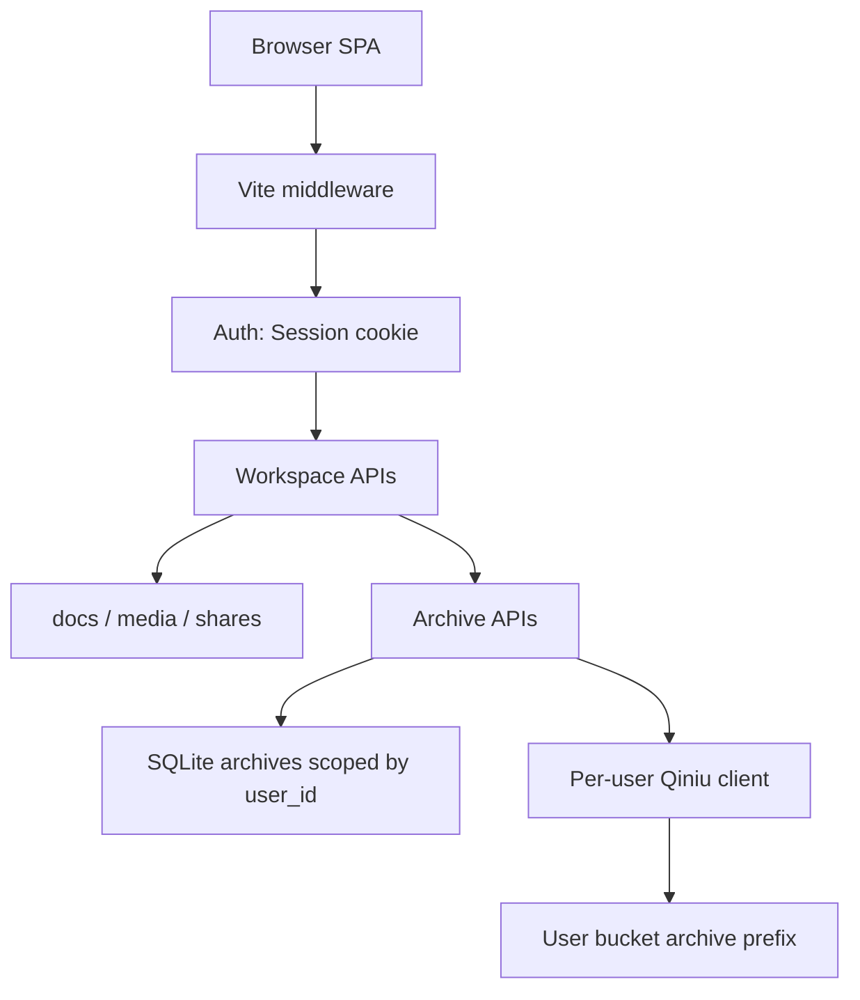
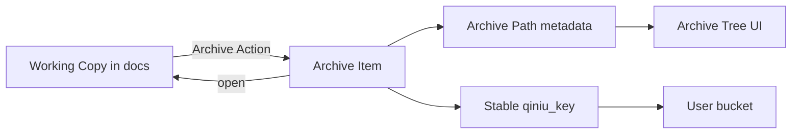

# 七牛归档目录树

Feature Name: qiniu-archive-tree
Updated: 2026-09-04

## Description

把「上传到七牛」定义为归档。Current User 将 Working Copy 写入本人对象存储后，得到可浏览、可拖拽整理、可打标签的 Archive Item。归档树与工作区 `doc_key` 相互独立；再归档覆盖同一对象存储 key，不保留多版历史。图片仍走媒体库，不进入归档树。分享版流程保持独立。

本设计建立在多用户隔离与每用户 Storage Profile 之上：全部归档读写从 Session 注入 `user_id`。

已锁定口径：

- 归档对象仅为 Markdown 文档。
- Archive Path 与工作区 `doc_key` 独立。
- 再归档覆盖同一 `qiniu_key`。

## Architecture

请求仍走 Vite 中间件鉴权。归档 API 与现有文档/媒体/分享并列，共用 `requireUser` 与 `requireUserStorage`。对象存储客户端按请求从 Storage Profile 构造。归档路径只存在 SQLite；七牛上的对象 key 在首次归档时生成，之后拖拽与重命名只改元数据。



归档与工作区的关系：



再归档：编辑器绑定 `archive_id` 后，显式保存触发覆盖上传，工作区 `docs` 行仍按现有 800ms 防抖写入。

## Components and Interfaces

### 1. 七牛覆盖上传 `src/server/qiniu-uploader.ts`

现有 `uploadToQiniu` 每次用 `buildKey()` 生成带时间戳的新 key，无法覆盖。扩展签名：

```
uploadToQiniu(config, buffer, filename, keyPrefix?, explicitKey?)
```

- `explicitKey` 缺省：行为与现在一致，调用 `buildKey(filename, keyPrefix)`。
- `explicitKey` 有值：PutPolicy `scope` 设为 `bucket:explicitKey`，允许覆盖；返回的 `key` 即该值。
- 归档首次上传：`keyPrefix = archive/{userId}`，生成 `archive/{userId}/{ym}/{stamp}.md`。
- 再归档：传入已有 `qiniu_key` 作为 `explicitKey`。

删除仍走现有 `deleteFromQiniu`。拖拽与重命名 **不** 调用七牛 move/copy。

### 2. 归档 API（并入 `src/server/api.ts` 或拆 `src/server/archive-api.ts`）

全部接口需登录；`user_id` 由 Session 注入。

```
GET    /api/archives                         列出当前用户 Archive Item 与空文件夹
POST   /api/archives                         归档：上传正文并创建 Item
GET    /api/archives/:id                     单条（含 content、tags、url）
POST   /api/archives/:id/rearchive           再归档：覆盖上传并更新 content / archived_at
POST   /api/archives/:id/move                { new_path } 改 Archive Path
DELETE /api/archives/:id                     删 SQLite 行并删七牛对象

POST   /api/archives/folders                 { path } 建空文件夹
POST   /api/archives/folders/move            { from_path, to_path } 前缀替换子孙路径
DELETE /api/archives/folders                 { path } 仅允许空文件夹

POST   /api/archives/:id/tags                { name } 绑定 Tag
DELETE /api/archives/:id/tags/:name          解绑 Tag
```

`GET /api/archives` 查询参数：

- `tag`：按 Tag 精确筛选；返回命中的 Item，并附带这些 Item 路径上的祖先文件夹名，供前端保持层级可见。

`POST /api/archives` 请求体：

```
{
  content: string,
  filename: string,
  path?: string,
  doc_id?: number
}
```

- `path` 缺省：用关联文档的 `doc_key`；无 `doc_id` 时用 `filename`。
- 路径已被占用：409 `{ error: "归档路径已存在" }`。
- 未配置 Storage Profile：400，文案与现有上传一致。

`POST /api/archives/:id/rearchive` 请求体：`{ content: string }`。用该 Item 已有 `qiniu_key` 覆盖上传；更新 `content`、`size`、`archived_at`；`path` 与 `url` 保持不变。

路径规则：UTF-8 相对路径，`/` 分层，禁止 `.` / `..` 段，禁止前导 `/`，长度 1–240。文件名需以 `.md` 或 `.markdown` 结尾。

### 3. 数据层 `src/server/db.ts`

新增表在 `initDB()` 内 `CREATE TABLE IF NOT EXISTS`，用 `schema_meta.archive_tree=1` 标记一次性迁移完成。不改 `docs` / `media` / `shares` 结构。

空文件夹单独存，因为树由 Item 路径派生时无法表达空目录。Tag 按用户规范化小写存储（中文保持原样），同一 User 下同名 Tag 复用一行。

移动文件夹在单一 SQLite 事务中：

1. 校验 `to_path` 不是 `from_path` 自身或后代。
2. 计算每个受影响 Item 的新 path，预先检查目标冲突。
3. `UPDATE archives SET path=...`；`UPDATE archive_folders SET path=...`。
4. `COMMIT`。失败则整树保持原状。

跨用户 id：`SELECT/UPDATE/DELETE ... WHERE id=? AND user_id=?`，未命中由 API 返回 404。

### 4. 前端

#### 顶栏

- 新增按钮「归档」：对当前 Working Copy 执行 Archive Action。
- 新增按钮「归档库」：打开归档抽屉。
- 「上传图片到七牛」「生成分享版」「媒体库」保持现有语义。

当编辑器已绑定 Archive Item 时，「归档」按钮文案改为「再归档」。

#### 归档抽屉 `src/ui/archive.ts`

布局对齐媒体库抽屉（右侧 `drawer`）：

- 顶栏：搜索、Tag 筛选、关闭。
- 工具：新建文件夹。
- 主体：可折叠目录树。节点显示文件名、相对时间、Tag 芯片。
- 选中 Item：底部详情（完整 path、对象存储 url、标签编辑）。

交互：

- 单击文件：高亮并展示详情。
- 双击文件：打开该 Archive Item（见下节）。
- 拖拽：HTML5 Drag and Drop。文件拖到文件夹上 → `POST /api/archives/:id/move`；文件夹拖到文件夹上 → `POST /api/archives/folders/move`。非法目标（自身/后代/冲突）在 `dragover` 时拒绝 drop。
- 右键或节点操作按钮：重命名、删除、打标签。

树构建复用 `sidebar.ts` 的 `buildTree` 思路，输入改为 `path` 字段；空文件夹从 `folders` 列表并入 `folderMap`。

#### 再编辑

打开 Archive Item：

1. `GET /api/archives/:id` 取 `content`。
2. 若 `doc_id` 仍指向当前用户的 `docs` 行，则同时打开该工作区文档（侧边栏高亮 `doc_key`）；否则以归档 `path` 为 `currentDocKey` 把正文写入/upsert 工作区，保证编辑器仍有本地 Working Copy。
3. 设置 `currentArchiveId`。
4. 未归档改动：`editor.value !== archive.content`（打开时记下 `lastArchivedContent`）。状态区与归档按钮提示「有未归档改动」。

保存策略（避免 800ms 自动保存打到七牛）：

- 工作区 `saveCurrentDoc` 防抖逻辑不变，只写 `docs`。
- 再归档仅由「再归档」按钮或快捷键（与「归档」同一入口）触发。
- 切换文档 / 打开另一 Archive Item 前，若存在未归档改动，用 `confirm` 选择：再归档后切换、放弃改动后切换、取消。

正文来源以 SQLite `archives.content` 为准，打开时不下载七牛对象，避免私有桶签名过期。

### 5. 与现有能力的边界

| 能力 | 本功能中的角色 |
| --- | --- |
| 工作区文档树 | 日常编写；路径独立 |
| 媒体库 | 图片上传/删除；不进归档树 |
| 生成分享版 | mermaid 转图 + 分享记录；不改归档 |
| 快照 `doc_versions` | 仅工作区历史；归档不读不写 |

首次归档建议默认 path = 当前 `doc_key`，方便两边看起来同源；之后在归档树里拖拽只改 Archive Path。

## Data Models

```
archives (
  id           INTEGER PRIMARY KEY AUTOINCREMENT,
  user_id      INTEGER NOT NULL REFERENCES users(id),
  path         TEXT NOT NULL,
  title        TEXT NOT NULL DEFAULT '',
  filename     TEXT NOT NULL DEFAULT '',
  content      TEXT NOT NULL DEFAULT '',
  qiniu_key    TEXT NOT NULL,
  url          TEXT NOT NULL,
  size         INTEGER NOT NULL DEFAULT 0,
  doc_id       INTEGER,
  archived_at  INTEGER NOT NULL,
  created_at   INTEGER NOT NULL,
  UNIQUE(user_id, path)
)
CREATE INDEX idx_archives_user ON archives(user_id, archived_at DESC);

archive_folders (
  user_id    INTEGER NOT NULL,
  path       TEXT NOT NULL,
  created_at INTEGER NOT NULL,
  PRIMARY KEY (user_id, path)
)

archive_tags (
  id         INTEGER PRIMARY KEY AUTOINCREMENT,
  user_id    INTEGER NOT NULL,
  name       TEXT NOT NULL,
  UNIQUE(user_id, name)
)

archive_item_tags (
  archive_id INTEGER NOT NULL REFERENCES archives(id) ON DELETE CASCADE,
  tag_id     INTEGER NOT NULL REFERENCES archive_tags(id),
  PRIMARY KEY (archive_id, tag_id)
)
```

`GET /api/archives` 响应：

```
{
  items: ArchiveItem[],
  folders: string[]
}

ArchiveItem {
  id, path, title, filename, url, size,
  tags: string[],
  archived_at, created_at, doc_id
}
```

列表不返回 `content`；详情接口才返回正文。

Tag 校验：长度 1–24；字符类 `[A-Za-z0-9_\-\u4e00-\u9fff]`。同一 Item 重复添加同名 Tag 视为成功，不新增行。

## Correctness Properties

- 任意 `/api/archives*` 读写的 `user_id` 等于 Session 中的 User，客户端无法覆盖。
- `(user_id, path)` 在 `archives` 中唯一；不同 User 允许相同 Archive Path。
- 再归档使用该行已有 `qiniu_key`，不新建七牛对象，不改变 `path`。
- 拖拽或重命名只更新 SQLite 中的 `path` / 文件夹行，`qiniu_key` 与 `url` 保持原值。
- 文件夹移动在单一事务中完成，要么全部后代 path 更新，要么全部保持原值。
- 删除 Archive Item 时先删七牛对象，成功或七牛返回 612（对象已不存在）后再删 SQLite 行；Tag 绑定随 `ON DELETE CASCADE` 清除。
- Platform Admin 的账号 API 不查询其他 User 的 `archives.content`。
- 归档上传与删除使用 Current User 的已校验 Storage Profile。

## Error Handling

| 场景 | 行为 |
| --- | --- |
| 未登录 | 401 `{ error: "未登录" }` |
| 跨用户 id | 404 `{ error: "不存在" }` |
| 未配置存储 | 400 `{ error: "请先完成对象存储配置" }` |
| 路径冲突 | 409 `{ error: "归档路径已存在" }` |
| 非法 path（`..`、过长、非 md） | 400 `{ error: "归档路径不合法" }` |
| 拖入自身或后代文件夹 | 400 `{ error: "不能移动到自身或子目录" }` |
| 删除非空文件夹 | 409 `{ error: "文件夹非空" }` |
| Tag 格式非法 | 400 `{ error: "标签不合法" }` |
| 七牛上传/覆盖失败 | 502，错误信息截断至 200 字；SQLite 不写入新行或保持再归档前内容 |
| 七牛删除失败（非 612） | 502；SQLite 行保留，避免元数据与桶不一致 |
| 目标 Archive Item 在再归档前被删 | 404 |

前端：400/409/502 走现有 `setStatus(..., true)`。抽屉内操作失败后重新 `GET /api/archives` 以恢复树。

## Test Strategy

沿用 `node:test` + 临时 SQLite，文件放 `src/server/archive*.test.ts`。七牛调用用可注入的假客户端（扩展现有 storage 测试手法），不打真实网络。

覆盖点：

1. 创建归档：写入 `archives` 行，`path` 默认 `doc_key`，`user_id` 正确。
2. 隔离：User A 的 Item 对 User B 的 list 不可见；B 用 A 的 id 读写得 404。
3. 路径冲突：同一 User 第二次用相同 path 创建得 409；不同 User 允许相同 path。
4. 再归档：`qiniu_key` 不变，`content` 与 `archived_at` 更新。
5. 移动文件：path 变、key/url 不变；目标占用时 409。
6. 移动文件夹：子孙 path 前缀全部替换；拖入自身失败且数据不变。
7. 文件夹移动事务：人为制造目标冲突时零行更新。
8. Tag：添加/去重/筛选；非法字符 400。
9. 删除：假客户端收到原 `qiniu_key`；行与绑定 Tag 消失。
10. 空文件夹：可创建、可出现在 list、非空时拒绝删除。

手工验收：登录后归档一篇文档 → 归档库出现节点 → 拖到新文件夹 → 刷新后位置保持、对象 URL 仍可打开 → 双击打开改一字再归档 → 七牛上同 key 内容已更新 → 打标签后按标签筛选。

## References

[^1]: (Filename) - 本功能需求 `.monkeycode/specs/2026-09-04-qiniu-archive-tree/requirements.md`
[^2]: (Filename) - 多用户隔离基线 `.monkeycode/specs/2026-09-03-multi-user-rbac/design.md`
[^3]: (Filename#L689) - 媒体落库 `src/server/db.ts`
[^4]: (Filename#L17) - 上传中间件 `src/server/upload-api.ts`
[^5]: (Filename#L37) - 现有按时间戳生成 key `src/server/qiniu-uploader.ts`
[^6]: (Filename#L34) - 工作区文档树 `src/ui/sidebar.ts`
[^7]: (Filename#L1) - 媒体抽屉交互参照 `src/ui/media.ts`
