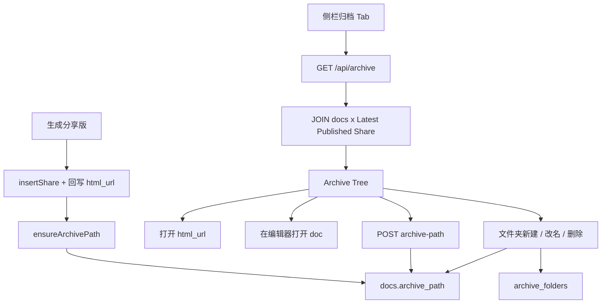
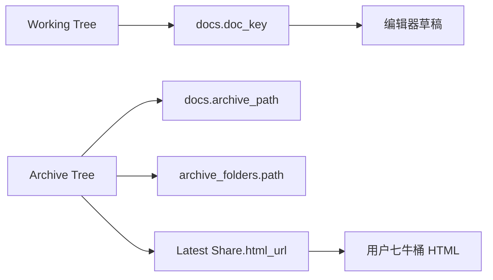

# 七牛分享归档目录树

Feature Name: qiniu-archive-tree
Updated: 2026-09-11

## Description

把「生成分享版且 HTML 已上传七牛」的文档视为归档条目，在侧栏用第二棵树展示。归档路径 `archive_path` 存在 `docs` 上，与 `doc_key` 解耦；移动归档目录不改草稿路径、不改七牛对象。每个 `doc_key` 一个节点，绑定最新一条带 `html_url` 的 Share。点击打开七牛 HTML；可从节点打开编辑器原稿。工作区草稿树保持全量。
支持新建空文件夹（`archive_folders` 落库）以及整夹改名前缀。归档树对草稿新于发布的节点显示「有未发布改动」。

## Architecture

归档资格由 Share.`html_url` 派生；文档位置由 `docs.archive_path` 持久化；空文件夹由 `archive_folders` 持久化。列表接口一次返回条目与文件夹，前端合并成树。



数据边界与现有多用户模型一致：所有读写带 `user_id`。



## Components and Interfaces

### 1. 数据层 `src/server/db.ts`

- `docs` 增加可空列 `archive_path TEXT`。
- 部分唯一索引：`UNIQUE(user_id, archive_path) WHERE archive_path IS NOT NULL`。
- `ensureArchivePath(userId, docKey)`：若该文档尚无 `archive_path`，写入 `doc_key`；若与已有路径或文件夹发生 Path Prefix Conflict，改为 `doc_key + '~' + doc.id`。回填走同一套规则，冲突时不让 `GET /api/archive` 失败。
- `listArchive(userId, q?)`：只返回「存在 `html_url` 非空 Share」的文档，每条附带 Latest Published Share 的 `share_id, html_url, md_url, created_at`。
- `listArchiveFolders(userId)`：当前用户全部 Explicit Archive Folder。
- `createArchiveFolder` / `renameArchiveFolder` / `deleteArchiveFolder`。
- `updateArchivePath(userId, docId, archivePath)`：校验后更新；冲突抛出 `HttpError 409`。
- 在 `updateShareHtmlUrl` 成功之后调用 `ensureArchivePath`（按该 Share 的 `doc_key`）。`insertShare` 若入参已带 `html_url`，同样调用。

Latest Published Share 选取规则：同一 `(user_id, doc_key)` 下 `html_url IS NOT NULL AND html_url != ''`，按 `created_at DESC, id DESC` 取第一条。

### 2. HTTP `src/server/api.ts`

```
GET    /api/archive?q=                      # { entries, folders }；q 过滤 title 或路径
POST   /api/docs/:id/archive-path           # { archive_path } 仅当该文档已归档
POST   /api/archive/folders                 # { path } 新建空文件夹
POST   /api/archive/folders/rename          # { from, to } 整夹改前缀
DELETE /api/archive/folders?path=           # 仅当该前缀下没有 Archive Entry
```

鉴权与工作区其它接口相同：`requireUser`，按 `user_id` 隔离。

`archive_path` 校验：

- 去掉首尾 `/` 与空白后长度 1～256。
- 分段用 `/` 连接，每段为非空，禁止 `.`、`..`。
- 禁止 ASCII 控制字符；括号、冒号、顿号等其余字符允许。
- 同一用户下不得与其它文档的 `archive_path` 相同。
- 同一用户下不得与其它 Explicit Archive Folder 的 `path` 相同。
- 禁止「同一路径既是文档又是文件夹」（路径相等或互为前缀）。

未归档文档调用 `POST .../archive-path` 返回 400「文档尚未归档」。
`DELETE /api/archive/folders` 在前缀下仍有 Archive Entry 时返回 400「文件夹内还有归档文档」。

`POST /api/archive/folders/rename` 在同一事务内：把所有 `archive_path` 与 folder `path` 中以 `from/` 开头的前缀换成 `to/`；把恰好等于 `from` 的 Explicit Archive Folder 改为 `to`。`from` 可以是隐式文件夹（没有 `archive_folders` 行）。文档路径不会恰好等于 `from`（与 Path Prefix Conflict 规则一致）。

### 3. 侧栏 `src/ui/sidebar.ts` + `index.html`

侧栏头增加两个 Tab：`草稿` | `归档`。默认 `草稿`，现有新建 / 导入 / 重命名 / 删除只在草稿 Tab。

归档 Tab：

- 复用 `buildTree`：文档用 `archive_path` + `title`，并并入 `folders[]` 中的空文件夹。
- 搜索走 `GET /api/archive?q=`，匹配条目的祖先文件夹与路径命中的空文件夹都保留。
- 点击文档主标签：`window.open(html_url)`。
- 文档操作：「移动」「打开原稿」「复制链接」。
- 文件夹操作：「重命名」「删除」（空夹才允许）。
- 归档 Tab 的「＋」改为新建文件夹；隐藏导入。
- `stale === true` 时节点旁显示「有未发布改动」。
- 空态：没有任何 entry 且没有任何 folder 时显示「还没有归档。生成分享版并上传 HTML 后会出现在这里。」

生成分享版成功后，若侧栏处于归档 Tab，调用 `sidebar.refresh()`。

不在本迭代做拖拽移动；移动交互与现有重命名一样用 `prompt`。

### 4. 分享回写 `src/ui/app.ts`

现有「生成分享版」在 `POST /api/share/:id/html` 成功后已经回写 `html_url`。服务端在该回写里 `ensureArchivePath`，前端无需额外接口。分享记录抽屉保持扁平时间线，不改。

## Data Models

`docs` 增量：

| 列 | 类型 | 说明 |
| --- | --- | --- |
| archive_path | TEXT NULL | 归档树路径；未归档为 NULL |

`GET /api/archive` 条目：

| 字段 | 说明 |
| --- | --- |
| id | docs.id |
| doc_key | 草稿路径 |
| title | 文档标题 |
| archive_path | 归档路径 |
| share_id | Latest Published Share id |
| html_url | 七牛 HTML |
| md_url | 七牛 Markdown，可空 |
| created_at | 该 Share 创建时间 |
| stale | Latest Published Share 有 `source_content_sha256` 且与当前 `docs.content` 的 SHA-256 不同 |

`archive_folders`：

| 列 | 类型 | 说明 |
| --- | --- | --- |
| id | INTEGER PK | |
| user_id | INTEGER | 所属用户 |
| path | TEXT | 文件夹路径，用户内唯一 |
| created_at | INTEGER | |

归档资格仍由 Share 派生，不另建「是否归档」标志。文档位置放在 `docs.archive_path`；只有用户显式新建的空文件夹进 `archive_folders`。

历史数据：已有 `html_url` 的 Share 在首次 `listArchive` 或下次回写时补 `archive_path`（默认 `doc_key`，冲突则 `doc_key~id`）。无 `source_content_sha256` 的旧分享不标 stale。删光 `html_url` 分享后保留 `docs.archive_path`。

`shares` 增量：`source_content_sha256 TEXT`。在 `insertShare`（已带 html_url）与 `updateShareHtmlUrl` 时，对当前 `docs.content` 写入 SHA-256。

## Correctness Properties

- 同一用户下，已赋值的 `archive_path` 唯一。
- 同一用户下，`archive_folders.path` 唯一。
- 不存在「同一路径既是 Archive Entry 又是 Archive Folder」。
- Path Prefix Conflict 在应用层检查；SQLite 部分唯一索引只保证路径字符串完全相同。
- 改 `archive_path` 不修改 `docs.doc_key`、`shares.doc_key`、七牛 key、`html_url`。
- 改 `doc_key`（工作区重命名）不修改 `archive_path`。
- Archive Tree 的文档节点数等于「当前用户下至少有一条 `html_url` 非空 Share 的 distinct `doc_key`」数量。
- 删除 Workspace Document 后，该文档不再出现在 `/api/archive`（现有 `deleteDoc` 已级联删 Share）。
- `/api/archive` 不返回其他用户的条目。
- 整夹改名要么全部前缀替换成功，要么整笔事务回滚。

## Error Handling

| 场景 | 处理 |
| --- | --- |
| Archive Path 与已有条目冲突 | 409，文案「归档路径已被占用」 |
| 路径非法 | 400，文案说明规则 |
| 文档未归档就改路径 | 400，「文档尚未归档」 |
| 文档不属于 Current User | 404 |
| `html_url` 打不开 | 前端 `setStatus` 错误；仍可「打开原稿」 |
| 列表查询失败 | 归档树空态「加载失败」 |
| 文件夹路径冲突 | 409，「归档路径已被占用」 |
| 删除非空文件夹 | 400，「文件夹内还有归档文档」 |

改路径失败时树保持原状。七牛对象不因移动/重命名归档路径而删除或拷贝。

## Test Strategy

在 `src/server/db.test.ts` 增加：

1. 写入带 `html_url` 的 Share 后，`listArchive` 含该文档且默认 `archive_path` 等于 `doc_key`。`notes.md` 与 `notes/a.md` 可同时存在。
2. 同一 `doc_key` 两次分享，列表只有一条且 `share_id` 为较新记录。
3. `updateArchivePath` 后 `doc_key` 不变；冲突第二次写入失败。
4. 无 `html_url` 的 Share 不出现在 `listArchive`。
5. 用户 B 看不到用户 A 的归档条目。
6. 新建空文件夹后 `listArchive.folders` 含该路径；其下没有文档时树仍显示该夹。
7. 重命名文件夹 `a` → `b` 后，原 `a/x` 的文档变为 `b/x`，`doc_key` 不变。
8. 删除非空文件夹失败；删光分享后对应文档从 entries 消失。
9. 改 `docs.content` 后 `stale` 为 true；只改 `updated_at` 或重命名 `doc_key` 时 `stale` 为 false。无 hash 的旧分享 `stale` 为 false。

手动验收：

1. 生成分享版后切到归档 Tab，文档出现在与 `doc_key` 对应的文件夹下。
2. 移动到 `项目/发布/新名字` 后刷新仍在新位置；草稿树路径不变。
3. 点击节点打开七牛 HTML；「打开原稿」回到编辑器。
4. 删掉该文档全部带 `html_url` 的分享后，归档树不再列出。
5. 新建空文件夹可见；把文档移入后刷新仍在；空夹可删，有文档时删除被拒绝。
6. 整夹改名后子文档与子文件夹前缀一起变。
7. 改草稿但不重新生成分享版时，归档节点出现「有未发布改动」。

## References

[^1]: (Filename) - 需求 `.monkeycode/specs/2026-09-11-qiniu-archive-tree/requirements.md`
[^2]: (Filename) - 文档树 `src/ui/sidebar.ts`
[^3]: (Filename) - Share 回写 `src/server/db.ts` `updateShareHtmlUrl`
[^4]: (Filename) - 工作区文档树需求 `需求描述.md` FR-01
