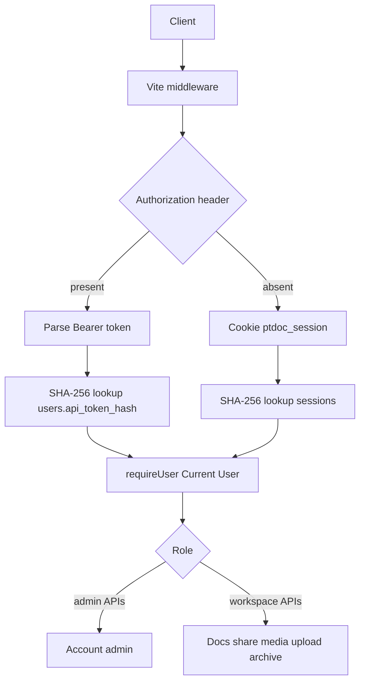

# 静态 API Token 鉴权

Feature Name: static-api-token
Updated: 2026-09-12

## Description

在现有 Session Cookie 鉴权上增加一枚每用户静态 API Token。脚本通过 `Authorization: Bearer` 进入与登录后相同的 `requireUser` 通道；浏览器继续用 Cookie。Token 由用户在设置页自行填写，服务端只存 SHA-256 哈希。Role、Workspace 隔离、停用策略沿用多用户 RBAC。

## Architecture

鉴权入口仍是 `requireUser`。请求带 `Authorization` 头则只走 Bearer，查 `users.api_token_hash`；否则走现有 Cookie → `sessions` 表。识别出 Current User 之后，业务中间件不变。



Bearer 成功路径不调用 `touchSession` / `setSessionCookie`。Cookie 路径行为保持滑动 7 天。

## Components and Interfaces

### 1. 鉴权层 `src/server/auth.ts`

扩展 `requireUser(req, res)`：

1. 若 `Authorization` 头存在（含空字符串），进入 Bearer 分支：解析 `Bearer <token>`（scheme 大小写不敏感），`hashToken` 后 `getUserByApiTokenHash`；命中且 `status=active` 则返回 User；缺失、格式错误、无匹配、停用分别抛现有 `HttpError` 401/403。此分支不刷新 Session、不写 Cookie。
2. 若 `Authorization` 头不存在，保持现有 Cookie 逻辑。

新增：

- `API_TOKEN_RE = /^[A-Za-z0-9]{16,64}$/`
- `validateApiToken(raw)`：trim 后匹配正则，失败抛 400「API Token 为 16–64 位字母或数字」
- `parseBearer(authorization)`：合法则返回明文 token，否则抛 401「未登录」

哈希复用已有 `hashToken`（SHA-256 hex），与 Session 一致。API Token 是用户口令的替代物但长度下限 16 且字符集受限，不做 scrypt。

### 2. 账号 API `src/server/auth-api.ts`

新增（均需 `requireUser`，可用 Cookie 或 Bearer）：

```
POST   /api/auth/token     { token: string } -> { ok: true, has_api_token: true }
DELETE /api/auth/token     -> { ok: true, has_api_token: false }
GET    /api/auth/me        现有字段 + has_api_token: boolean
```

`POST /api/auth/token`：`validateApiToken` → 哈希 → 若其他用户已占用该哈希则 409「API Token 已被使用」→ `setUserApiTokenHash(user.id, hash)`。

`DELETE /api/auth/token`：`setUserApiTokenHash(user.id, null)`。

`toPublicUser` 增加 `has_api_token: boolean`（`!!user.api_token_hash`）。`listUsers` 继续不返回哈希。

公开路径不变：`/api/setup*`、`POST /api/auth/register`、`POST /api/auth/login`。这些路径忽略 Bearer，也不把 Bearer 当登录手段。

改密、logout、停用账号：不清除 `api_token_hash`。停用后 `requireUser` 仍对 Bearer 返回 403「账号已停用」。

### 3. 数据访问 `src/server/db.ts`

`initDB()` 增量迁移：若 `users` 无 `api_token_hash` 列则 `ALTER TABLE users ADD COLUMN api_token_hash TEXT`，并 `CREATE UNIQUE INDEX IF NOT EXISTS idx_users_api_token ON users(api_token_hash)`。SQLite 唯一索引允许多个 NULL，未配置 Token 的用户互不冲突。

新增：

- `getUserByApiTokenHash(hash): UserRow | undefined`
- `setUserApiTokenHash(userId, hash | null)`：写入前若 `hash` 非空，查其他 `id` 是否已占用，占用则抛 `HttpError(409)`

`UserRow` 增加可选 `api_token_hash: string | null`。

### 4. 业务中间件

`api.ts` / `upload-api.ts` 已调用 `requireUser`，无需改路径。Bearer 与 Cookie 在同一函数汇合后，`user.id` 注入方式不变。

### 5. 前端 Settings Page `src/ui/settings.ts`

在「修改密码」下增加「API Token」区块：

- 状态文案：已配置 / 未配置，来自 `GET /api/auth/me` 的 `has_api_token`
- 输入框：用户粘贴新 Token，不回显旧值
- 「保存 Token」→ `POST /api/auth/token`
- 「清空 Token」→ `DELETE /api/auth/token`，仅当已配置时可用

浏览器编辑器继续只走 Cookie；设置页保存 Token 也走 Cookie。

## Data Models

```
users (
  ...existing columns...
  api_token_hash TEXT           -- SHA-256 hex，未配置为 NULL
)
CREATE UNIQUE INDEX idx_users_api_token ON users(api_token_hash);
```

每人最多一枚有效 Token：一列覆盖设置与轮换。清空写 NULL。

## Correctness Properties

- 任意需登录接口的 Current User 来自 Bearer 哈希命中或 Session 命中，客户端无法在 JSON 里指定 `user_id`。
- 同一 `api_token_hash` 在 `users` 中最多对应一个 User。
- Bearer 鉴权响应不包含 `Set-Cookie: ptdoc_session=...`。
- `GET /api/auth/me`、`GET /api/admin/users`、Settings Page 均不返回 Token 明文或哈希。
- 停用账号后，该 User 的 Bearer 与 Cookie 请求均被拒绝。
- 修改登录密码、退出登录后，该 User 的 `api_token_hash` 保持原值。

## Error Handling

| 场景 | 行为 |
| --- | --- |
| 无 Cookie 且无 Authorization | 401 `{ error: "未登录" }` |
| Authorization 存在但 scheme/token 非法 | 401 `{ error: "未登录" }` |
| Bearer 与任何哈希不匹配 | 401 `{ error: "未登录" }` |
| Bearer 所属账号已停用 | 403 `{ error: "账号已停用" }` |
| Token 长度或字符集非法 | 400 `{ error: "API Token 为 16–64 位字母或数字" }` |
| Token 与其他用户冲突 | 409 `{ error: "API Token 已被使用" }` |
| Member 持合法 Bearer 调 `/api/admin/*` | 403 `{ error: "权限不足" }` |

Bearer 失败文案与 Session 失败对齐，避免泄露 Token 是否曾存在。

## Test Strategy

扩展 `src/server/auth.test.ts`（`node:test` + 临时 SQLite）：

1. 设置合法 Token 后，带 `Authorization: Bearer ...` 的 `requireUser` 返回该 User，且 `res.setHeader` 未被写成 Session Cookie。
2. 错误 Token、缺 Bearer 内容、未配置 Token 的用户带 Authorization，均 401。
3. Cookie 与 Bearer 同时出现时，Current User 以 Bearer 为准。
4. 轮换后旧 Token 401，新 Token 成功；清空后 Bearer 401，Cookie 仍可用。
5. 两用户提交相同 Token，后者 409。
6. 停用后 Bearer 403；改密后 Bearer 仍成功。
7. `validateApiToken`：15 位、含符号、空串失败；16 位字母数字成功。

手工验收：设置页保存 Token，用 curl `-H 'Authorization: Bearer ...'` 调 `GET /api/auth/me` 与 `GET /api/docs`；不带头仍靠浏览器 Cookie。

## References

[^1]: (Filename) - 本功能需求 `.monkeycode/specs/2026-09-12-static-api-token/requirements.md`
[^2]: (Filename) - 多用户鉴权基线 `.monkeycode/specs/2026-09-03-multi-user-rbac/design.md`
[^3]: (Filename#L76) - 现有 `requireUser` `src/server/auth.ts`
[^4]: (Filename#L41) - 账号中间件 `src/server/auth-api.ts`
[^5]: (Filename#L326) - `UserRow` 与 users 表 `src/server/db.ts`
[^6]: (Filename#L12) - Settings 抽屉 `src/ui/settings.ts`
