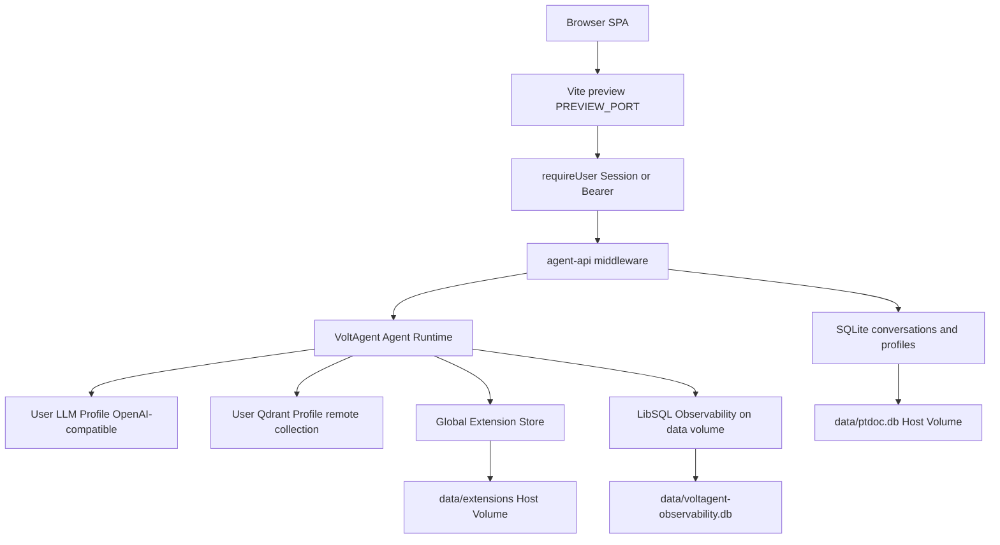
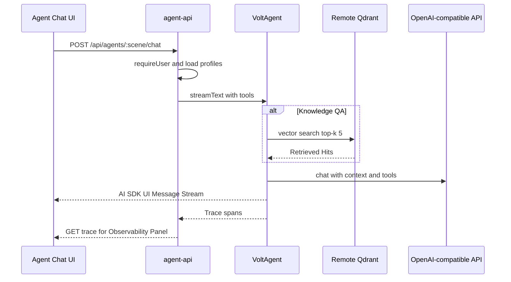

# VoltAgent 双场景智能体

Feature Name: voltagent-agents
Updated: 2026-09-12

## Description

在现有 PTDoc 单容器、Vite 中间件、SQLite 多用户平台上接入 VoltAgent，提供知识库问答与 Markdown 编写两个场景。大模型与远程 Qdrant 按 User 配置；MCP / Skill / 插件由 Platform Admin 全局配置，文件与安装产物落在已有 Host Volume `data/`。对话抽屉流式输出，并内嵌 VoltAgent Trace（检索命中、工具调用、耗时、Token）。

锁定决策：

- Agent Runtime 与 PTDoc API 同进程，对外仍只暴露 `PREVIEW_PORT`。
- 知识库只检索远程 Qdrant 已有 collection。
- 扩展仅 Platform Admin 可增删查改，更新为整份覆盖，所有 User 共用已启用项。
- Markdown 草稿经 Draft Diff 接受后才调用现有文档写入接口。
- 问答可 Handoff 到编写；Retrieved Hit 可 Citation Insert。
- 密钥复用 `PTDOC_DATA_KEY` 的 AES-256-GCM。
- 远程 Qdrant 支持文本 query（Cloud Inference / FastEmbed 等已配在 collection 上），PTDoc 不在本地做 embedding。
- Plugin zip 根目录 ESM `index.js` 或 `index.mjs`，`export const tools = [...]`，形状与 VoltAgent `createTool` 一致。
- 对话响应为 AI SDK UI Message Stream（VoltAgent `streamText` 管道）；前端 vanilla TS 解析，不引入 React。
- Qdrant query 只带问题原文、limit、可选 `using` vector 名，不传 inference 模型名。
- Plugin 解压后若有 `package.json`，在该目录 `npm install --omit=dev`，产物留在卷上。
- 远程知识库为自建 Qdrant + FastEmbed；JS client 走 REST，query 只带文本。

## Architecture

浏览器只打 PTDoc 已暴露端口。Vite 中间件鉴权后调用同进程 VoltAgent；Qdrant 与 OpenAI 兼容网关在远端。扩展与可观测库都在 `/app/data`。



一轮对话：



容器重建后，`data/` 卷上的 SQLite、扩展目录、可观测库原样挂回，启动时 `loadExtensions()` 按启用状态重新挂到两个 Agent。

可选：进程内再起 VoltAgent Hono 于 `127.0.0.1:3141`，仅本机 VoltOps Console 调试；生产对话不走该端口，也不对外映射。

## Components and Interfaces

### 1. Agent Runtime `src/server/agent-runtime.ts`

进程启动（`vite.config.ts` 的 `bootServer`）时创建单例：

- `knowledgeQaAgent`：`tools` 含 Qdrant retriever tool（按请求注入当前 User 的 Qdrant Profile）。
- `markdownWriterAgent`：`tools` 含 `list_workspace_docs`、`read_workspace_doc`；禁止直接写盘。
- 两者启动时合并全局已启用 MCP tools、Skill 指令、Plugin tools。

模型按请求构造，避免进程级单例绑死某一 User 的 Key：

```
createOpenAICompatible({
  name: "user-llm",
  baseURL: llmProfile.base_url,
  apiKey: decryptSecret(llmProfile.api_key_enc),
})
```

DeepSeek 等网关走 OpenAI 兼容 `/v1`。`model` 字符串使用 User 填写的模型名。

`VoltAgentObservability` 使用 `LibSQLObservabilityAdapter({ url: "file:./data/voltagent-observability.db" })`。对话 API 同时把摘要 Trace 写入 `agent_traces` 表，供界面稳定读取。

### 2. 对话与配置 API `src/server/agent-api.ts`

新中间件，挂到现有 `configureServer` / `configurePreviewServer`，前缀 `/api/agents` 与 `/api/admin/extensions`。全部 `requireUser`。

User 接口：

```
GET    /api/agents/llm                 当前 LLM Profile（api_key 仅 secret_configured）
PUT    /api/agents/llm                 { base_url, api_key?, model }
GET    /api/agents/qdrant              当前 Qdrant Profile（api_key 仅 secret_configured）
PUT    /api/agents/qdrant              { url, api_key?, collection, vector_name?, top_k? }
GET    /api/agents/extensions          Member：已启用扩展的 name/type；Admin：全量含停用项
GET    /api/agents/conversations?scene=qa|writer
POST   /api/agents/conversations       { scene } -> { id }
GET    /api/agents/conversations/:id
DELETE /api/agents/conversations/:id
POST   /api/agents/conversations/:id/chat
       body { input: string, doc_id?: number }
       response: text/event-stream
POST   /api/agents/conversations/:id/handoff
       { turn_id } -> { writer_conversation_id }
POST   /api/agents/conversations/:id/apply-draft
       { mode: "replace-current"|"create", doc_id?: number, doc_key?: string, content: string }
GET    /api/agents/conversations/:id/draft-diff
       { target_doc_id? , content } -> { hunks }
GET    /api/agents/conversations/:id/turns/:turnId/trace
POST   /api/agents/conversations/:id/stop
POST   /api/agents/conversations/:id/retrieve   { query }
```

`POST .../chat` 请求体仍为 `{ input, doc_id? }`，服务端拼该 Conversation 全部轮次后调用 VoltAgent `streamText`。响应为 AI SDK UI Message Stream（`text/event-stream`）：

- `text-delta`：增量文本
- `tool-*`：工具调用与结果（含检索）
- `data-draft`：Writer 完整 Markdown 草稿（可 apply）
- `finish`：结束；随后或并行 `data-done` 带 `{ turn_id, trace_id }`
- `error`：可展示错误

前端用 `fetch` + ReadableStream 解析该协议（Cookie 会话），不引入 React / `useChat`。

Admin 接口（`requireAdmin`）：

```
GET    /api/admin/extensions?kind=mcp|skill|plugin&q=
GET    /api/admin/extensions/:id
POST   /api/admin/extensions/mcp
PUT    /api/admin/extensions/mcp/:id
POST   /api/admin/extensions/skills
PUT    /api/admin/extensions/skills/:id
POST   /api/admin/extensions/plugins
PUT    /api/admin/extensions/plugins/:id
POST   /api/admin/extensions/:id/enable
POST   /api/admin/extensions/:id/disable
DELETE /api/admin/extensions/:id
```

Member 调用写扩展接口返回 403「权限不足」。GET /api/agents/extensions 只回已启用的 name 与 kind。

覆盖规则：MCP 的 PUT 整份替换 config_json，请求里带了 env 或 headers 才替换密文。stdio MCP 的 command 可为任意可执行文件，仅 Platform Admin 可配。Skill / Plugin 以 zip 上传，Skill zip 根目录必须有 SKILL.md；PUT 先清空目录再解压覆盖，缺 SKILL.md 则 400 且旧目录保持原样。同类 name 唯一，冲突 409。标识不存在 404。保存后立刻试加载并返回工具数或失败原因。chat 携带当前 Conversation 全部轮次。DELETE Conversation 级联消息与 Trace。

### 3. Qdrant 检索 `src/server/qdrant-retriever.ts`

实现 VoltAgent `BaseRetriever`。每次 `retrieve`：

1. `QdrantClient` 连远程 `url`，带可选 API Key。
2. 把问题原文作为 query text 发给 collection（服务端向量化）；可选 `vector_name`。
3. `limit = top_k` 默认 5，上限 20。超时 8 秒。
4. payload 映射：title 取 title/path/source/url 之一；snippet 取 text/content/page_content/body 截断 500 字。
5. `options.context.set("references", hits)`。

目标集群为自建 Qdrant + FastEmbed。调用：`client.query(collection, { query: questionText, limit, using: vector_name? })`，REST。PTDoc 不传 inference 模型名、不先调 embedding、不发 float 向量。Qdrant 拒绝文本查询时返回「该 collection 未启用服务端向量化」。本阶段没有 upsert / 切块 / 工作区同步。

### 4. Markdown Writer 工具与落盘

工具只读：

- `list_workspace_docs`：`listAllDocs(userId)`，返回 `doc_key` + `title`
- `read_workspace_doc`：按 `doc_id` 或 `doc_key` 读全文，越权返回「文档不存在」

聊天请求可带当前 `doc_id`，Runtime 把该文档全文放进 instructions 附加块。

智能体在回复中产出草稿时，服务端识别围栏或发出 `data-draft`。UI 先选目标（当前文档 / 新文档），再请求 draft-diff 展示行级差异。Current User 接受后走 `POST .../apply-draft`。未接受时 Workspace 不变。

问答完成轮次显示「交给编写智能体」：`POST .../handoff` 新建 writer Conversation，起始消息包含问题、回答、Retrieved Hits。

Citation Insert 由前端把 Hit 标题与片段写成 Markdown 插入编辑器光标，不改服务端文档直到编辑器自动保存。

### 5. Extension Store `src/server/extension-store.ts`

全局、无 `user_id`。元数据在 SQLite，文件在 Host Volume。

```
data/extensions/
  skills/<id>/SKILL.md
  skills/<id>/...
  plugins/<id>/
  mcp-npm/          # stdio MCP npx 缓存，重建后免重新下载
```

启动：`loadExtensions()` 读 `enabled=1` 行，构造 `MCPConfiguration`，Skill 文本拼进两个 Agent 的 instructions，Plugin 动态 import 后 `createTool`。

Plugin 加载契约：

```
data/extensions/plugins/<id>/index.js   # 或 index.mjs
export const tools = [ /* VoltAgent createTool 结果 */ ]
```

保存后 `import(fileURL)` 动态加载。缺入口文件或 `tools` 非数组则试加载失败，扩展保持停用。本阶段不对插件做沙箱隔离，仅 Platform Admin 可上传。

解压后若存在 `package.json`，在 `data/extensions/plugins/<id>/` 执行 `npm install --omit=dev`（超时 120 秒，registry 用环境默认）。`node_modules` 留在 Host Volume，容器重建后不再装。安装失败则本次保存失败，旧目录保持原样。无 `package.json` 则跳过安装，仍尝试加载入口文件。

stdio MCP 的 `command/args/env` 原样保存；`cwd` 固定为 `data/extensions/mcp-npm`。Admin 保存后若 command 为 `npx`，在该目录执行一次安装，产物留在卷上。

MCP 密钥（headers / env）用 `encryptSecret` 落库，列表接口只回 `secret_configured`。

增、改、覆盖、启用、停用、删除成功后均调用 `reloadAgentTools()`，已打开 Conversation 的下一 Turn 生效。删除时先删 SQLite 行，再移除 file_dir。

### 6. 前端

#### Settings `src/ui/settings.ts`

新增两块，布局对齐现有七牛配置：

- LLM：Base URL、模型名、API Key（只显示已配置/未配置）
- Qdrant：URL、collection、API Key 状态、可选 vector 名、top_k

#### Admin `src/ui/admin.ts`

账号管理抽屉增加「智能体扩展」页，MCP / Skill / 插件三类列表均可筛选与点开详情。操作：新增、编辑保存（覆盖）、Skill/Plugin 再次上传覆盖全部文件（保存前二次确认）、删除（二次确认）、启用/停用开关。Member 顶栏不出现该页。

#### 对话 `src/ui/agent-chat.ts`

顶栏「智能体」打开抽屉：

- 场景切换：知识库问答 | 文档编写
- 历史 Conversation 列表
- 流式消息区
- 右侧 Observability Panel：Retrieved Hits、工具时间线、模型名、Token、耗时 ms、Trace id
- Writer 草稿条：写入当前 / 另存为

`fetch('/api/agents/...')` 带 Cookie。chat 用 `fetch` + ReadableStream 解析 AI SDK UI Message Stream；停止生成用 AbortController，并 `POST .../stop`。

样式进 `src/ui/styles.css`，抽屉模式复用 `.drawer`。

### 7. 部署 `deploy/docker-compose/docker-compose.yml`

现有 `../../data:/app/data` 已覆盖 Extension Store、conversations、LLM/Qdrant 密文、observability.db。compose 不新增服务、不新开端口。

`.env.example` 可增加可选：

```
VOLTAGENT_PUBLIC_KEY=
VOLTAGENT_SECRET_KEY=
```

有值则 VoltOps 远端导出开启；空则仅本地 Trace。

Dockerfile 运行阶段增加 VoltAgent 相关 npm 依赖（`@voltagent/core`、`@voltagent/libsql`、`@qdrant/js-client-rest`、OpenAI 兼容 provider）。stdio MCP 若需 `npx`，运行镜像保持 Node 可用。

### 8. 启动胶水 `vite.config.ts`

`bootServer` 在 `initDB()` 之后调用 `initAgentRuntime()`。中间件顺序：`authApi` → `agentApi` → `upload` → `api`。

预览环境单端口规则：前端请求一律 `/api/agents/*`，由 Vite 中间件处理，无需浏览器直连 3141。

## Data Models

增量迁移，全部位于 `data/ptdoc.db`，与现有 `initDB()` 同路径。

```
llm_profiles (
  user_id        INTEGER PRIMARY KEY,
  base_url       TEXT NOT NULL,
  api_key_enc    TEXT NOT NULL,
  model          TEXT NOT NULL,
  updated_at     INTEGER NOT NULL
)

qdrant_profiles (
  user_id              INTEGER PRIMARY KEY,
  url                  TEXT NOT NULL,
  api_key_enc          TEXT,
  collection           TEXT NOT NULL,
  vector_name          TEXT,
  top_k                INTEGER NOT NULL DEFAULT 5,
  updated_at           INTEGER NOT NULL
)

agent_extensions (
  id            INTEGER PRIMARY KEY AUTOINCREMENT,
  kind          TEXT NOT NULL,          -- mcp | skill | plugin
  name          TEXT NOT NULL,
  enabled       INTEGER NOT NULL DEFAULT 1,
  config_json   TEXT NOT NULL,          -- 非密钥连接参数
  secrets_enc   TEXT,                   -- AES-GCM 打包的 headers/env/api_key
  file_dir      TEXT,                   -- 相对 data/extensions 的目录
  created_at    INTEGER NOT NULL,
  updated_at    INTEGER NOT NULL,
  UNIQUE(kind, name)
)

agent_conversations (
  id            INTEGER PRIMARY KEY AUTOINCREMENT,
  user_id       INTEGER NOT NULL,
  scene         TEXT NOT NULL,          -- qa | writer
  title         TEXT NOT NULL DEFAULT '',
  created_at    INTEGER NOT NULL,
  updated_at    INTEGER NOT NULL
)

agent_turns (
  id              INTEGER PRIMARY KEY AUTOINCREMENT,
  conversation_id INTEGER NOT NULL,
  user_id         INTEGER NOT NULL,
  role            TEXT NOT NULL,        -- user | assistant
  content         TEXT NOT NULL,
  draft_md        TEXT,
  trace_id        TEXT,
  created_at      INTEGER NOT NULL
)

agent_traces (
  trace_id        TEXT PRIMARY KEY,
  user_id         INTEGER NOT NULL,
  conversation_id INTEGER NOT NULL,
  turn_id         INTEGER NOT NULL,
  model           TEXT,
  input_tokens    INTEGER,
  output_tokens   INTEGER,
  latency_ms      INTEGER,
  hits_json       TEXT,                 -- Retrieved Hit[]
  spans_json      TEXT,                 -- 工具/MCP 时间线
  created_at      INTEGER NOT NULL
)
```

索引：`agent_conversations(user_id, scene, updated_at DESC)`、`agent_turns(conversation_id, id)`、`agent_traces(user_id, conversation_id)`。

`top_k` 写入时钳制 1–20。`scene` 仅 `qa` | `writer`。

## Correctness Properties

- 对话、LLM Profile、Qdrant Profile、Trace 的读写 `user_id` 等于 Current User，请求体不能指定他人 `user_id`。
- Platform Admin 列表扩展时仍读不到其他 User 的对话、Trace、LLM/Qdrant 密钥。
- Member 对 `/api/admin/extensions*` 的 POST/PUT/DELETE 得到 403。
- 同一 `(kind, name)` 在 `agent_extensions` 中最多一行。
- Skill 覆盖成功后，file_dir 内业务文件等于本次 zip；Plugin 覆盖成功后业务文件等于本次 zip，另允许生成 `node_modules`。
- 删除成功后，按原 id 的 GET 返回 404。
- 接口与前端打包均不返回 `api_key`、MCP env、headers 明文。
- 未执行 `apply-draft` 时 `docs.content` 与请求前一致。
- Host Volume 保留时，容器重建后 `agent_extensions.enabled` 集合与重建前相等，且已启用扩展在下一 Turn 可加载。
- Knowledge QA 本阶段对 Qdrant 只发 query，不发 upsert/delete。
- Bearer 与 Cookie 在 `requireUser` 汇合后进入 agent-api，行为与现有文档接口相同。

## Error Handling

| 场景 | 行为 |
| --- | --- |
| 无 LLM Profile 却发 chat | 400「请先在设置中填写大模型 Base URL、API Key 与模型名」 |
| LLM 网关失败 | 流内 `error`，保留已流式文本；Trace 标记失败 |
| 无 Qdrant Profile 却走 qa | 400「请先在设置中填写 Qdrant URL 与 collection」 |
| Qdrant 超时或网络失败 | 8 秒后流内说明「知识库连接失败」+ 完成 Trace |
| Qdrant 空命中 | 回答说明未命中；Panel 展示 0 条 Hit |
| MCP 连接失败 | 对话继续；span 记录失败原因 |
| Member 写扩展 | 403「权限不足」 |
| MCP 配置缺 name/transport | 400 字段级错误 |
| 同类重名新增或改名 | 409「扩展名称已存在」 |
| 标识不存在的 GET/PUT/DELETE | 404「扩展不存在」 |
| Skill 覆盖缺少 SKILL.md | 400，旧目录保持原样 |
| apply-draft 非法 doc_key 或冲突 | 409/400，Workspace 不变 |
| 流中断 | 已收到文本写入该 Turn；UI 显示「回复中断」 |
| Plugin `npm install` 失败 | 400，旧目录保持原样 |

## Test Strategy

沿用 `node --test`，新文件 `src/server/agent-api.test.ts`、`src/server/extension-store.test.ts`、`src/server/qdrant-retriever.test.ts`。Qdrant 与 LLM 用注入 fake client，不打真实网络。

覆盖：

1. 无 LLM Profile 时 chat 返回 400。
2. qa 场景无 Qdrant Profile 返回 400。
3. retriever 把 fake Qdrant 命中映射为 5 条 Hit（id/title/snippet/score）。
4. Member POST/PUT/DELETE `/api/admin/extensions/mcp` 得 403；Admin POST 得 200 且行写入 `agent_extensions`。
5. Admin PUT MCP 后详情为新配置；Admin PUT Skill 后文件列表等于新包；缺 SKILL.md 的覆盖保持旧文件。
6. Admin DELETE 后 GET 该 id 得 404；同类重名 POST 得 409。
7. apply-draft 未调用时 docs 行内容不变；确认 replace-current 后内容等于草稿。
8. create 模式冲突 `doc_key` 得 409。
9. Conversation/Trace 用另一 user_id 读取得 403。
10. 扩展 `enabled=1` 经「模拟重启」`loadExtensions()` 后名称与启用状态不变。
11. Trace JSON 含 hits 与 spans，GET trace 接口按 user_id 过滤。
12. LLM/Qdrant GET 响应无 `api_key` 字段。
13. Plugin zip 含 `package.json` 时保存会触发安装；安装失败返回 400 且旧目录不变。

手动：`make up` 后在设置填 DeepSeek，Admin 加一条 MCP，对话能流式出字，重建容器后扩展列表仍在。

## References

- VoltAgent MCP：https://voltagent.dev/docs/agents/mcp/
- VoltAgent Qdrant Retriever：https://voltagent.dev/docs/rag/qdrant/
- VoltAgent Observability / LibSQL：https://voltagent.dev/docs/observability/developer-console/
- VoltAgent Chat Stream：https://voltagent.dev/docs/api/streaming/
- AI SDK UI Message Stream：https://ai-sdk.dev/docs/ai-sdk-ui/stream-protocol
- 需求：`.monkeycode/specs/2026-09-12-voltagent-agents/requirements.md`
- 现有鉴权与密钥：`src/server/auth.ts`、`src/server/storage.ts`
- 现有部署卷：`deploy/docker-compose/docker-compose.yml`
