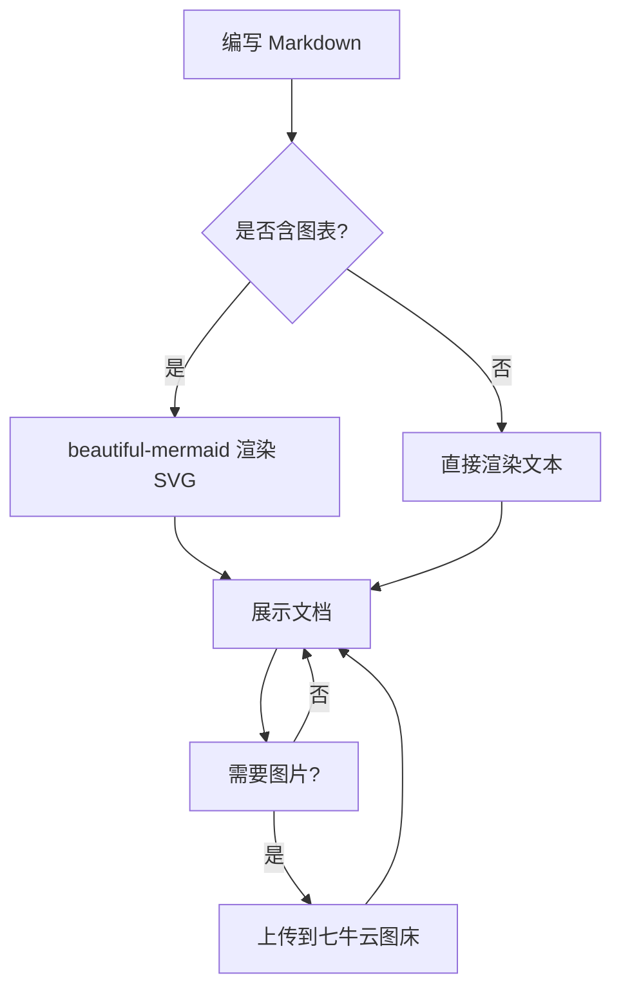

# 欢迎使用 PTDoc

这是一个整合了 **Markdown 渲染 + Mermaid 图表 + 七牛云图床** 的个人文档工具。

左侧写 Markdown，右侧实时预览；点右上角「上传图片到七牛」可把本地 PNG 上传到对象存储并自动插入图片引用。

## Mermaid 图表

用 ` ```mermaid ` 代码块即可绘制图表，由 `beautiful-mermaid` 渲染为 SVG：



## 图片引用示例

上传的图片会返回类似下面的 URL，直接写在文档里即可正常显示：

```md

```

> 提示：图片地址由七牛云返回，确保 `.env` 中已配置 `QINIU_*` 后上传功能才可用。

## 支持的 Markdown 特性（GFM）

- 表格、任务列表、删除线
- 代码高亮（由你后续接入）
- 行内数学公式（由你后续接入）
